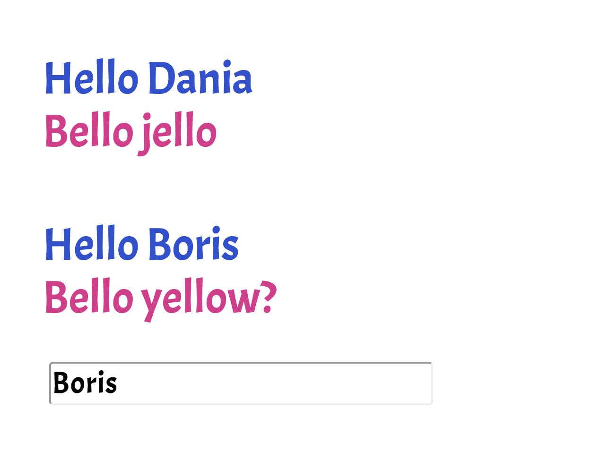

This was a Udemy assignment to test my knowledge on the fundamentals of React. You can launch this and whatever you type in the input field will change the second name.

Test run project only.
Check you have node and npm first!

# How To Use:

1. Clone the repo
```
git clone https://github.com/thatdania/UserInputUserOutput.git
```
2. Change the project folder directory
```
cd UserInputUserOutput
```

3. Npm install (just in case)
```
npm install
```

4. Npm start to get it going, to give it a try
```
Give it a try 
```

# The following tasks are below:

- Create TWO new components: UserInput and UserOutput

- UserInput should hold an input element, UserOutput two paragraphs

- Output multiple UserOutput components in the App component (any paragraph texts of your choice)

- Pass a username (of your choice) to UserOutput via props and display it there

- Add state to the App component (=> the username) and pass the username to the UserOutput component

- Add a method to manipulate the state (=> an event-handler method)

- Pass the event-handler method reference to the UserInput component and bind it to the input-change event

- Ensure that the new input entered by the user overwrites the old username passed to UserOutput

- Add two-way-binding to your input (in UserInput) to also display the starting username

- Add styling of your choice to your components/ elements in the components - both with inline styles and stylesheets
